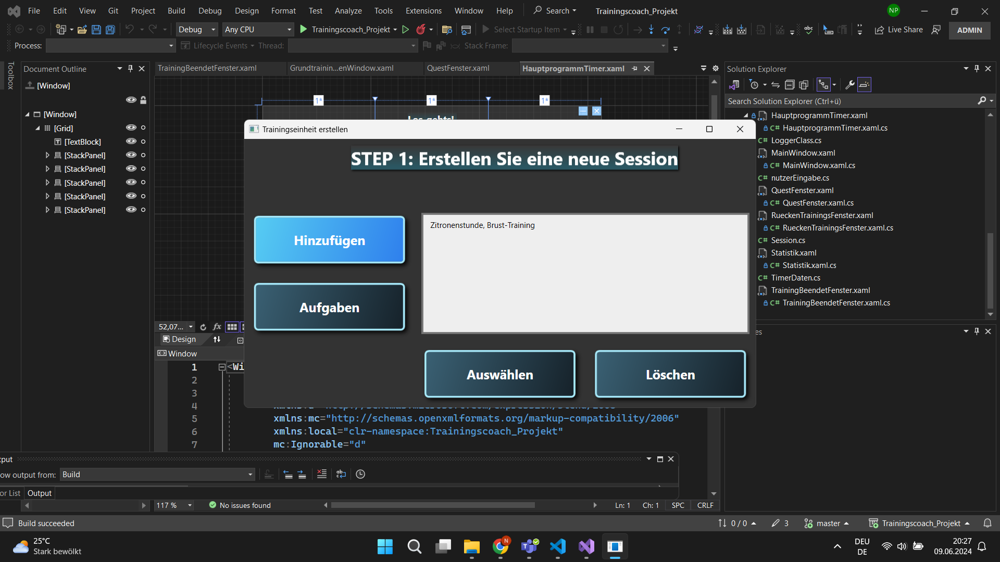
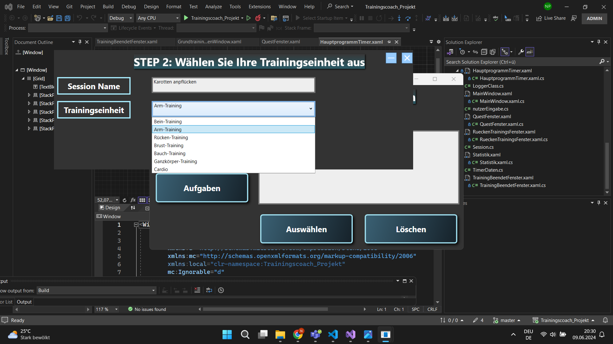
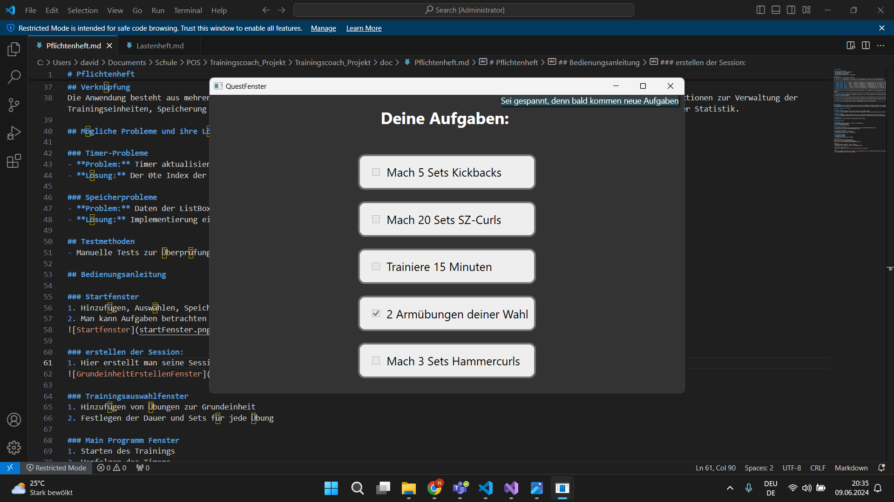
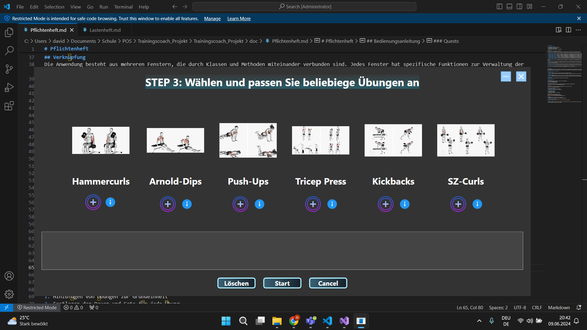
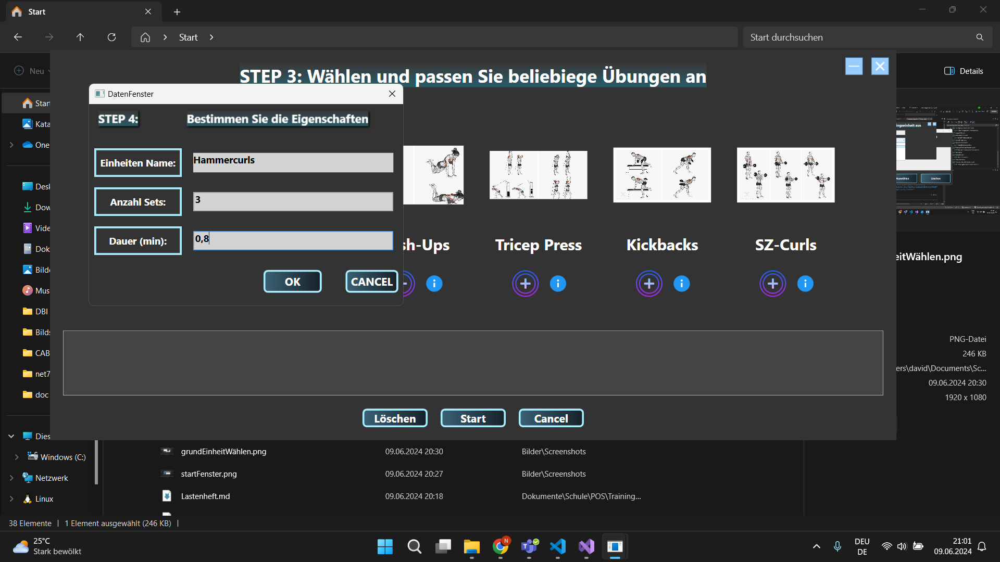
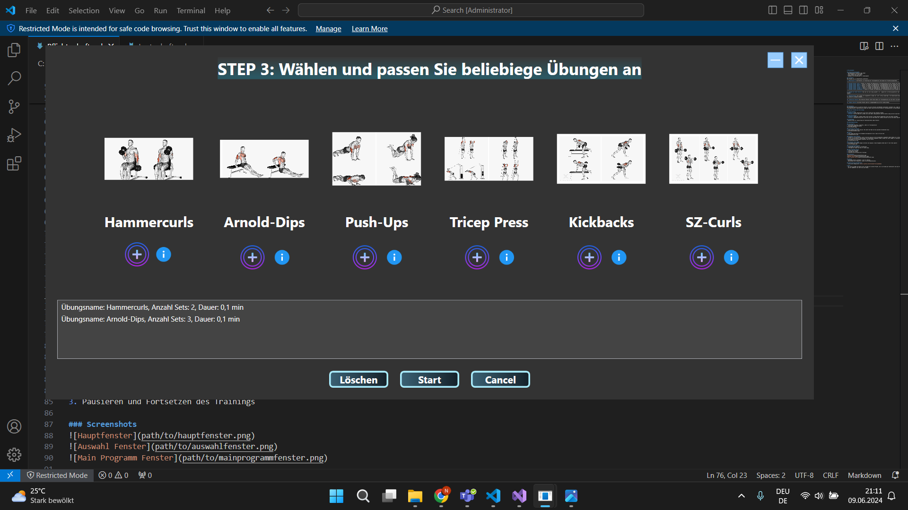
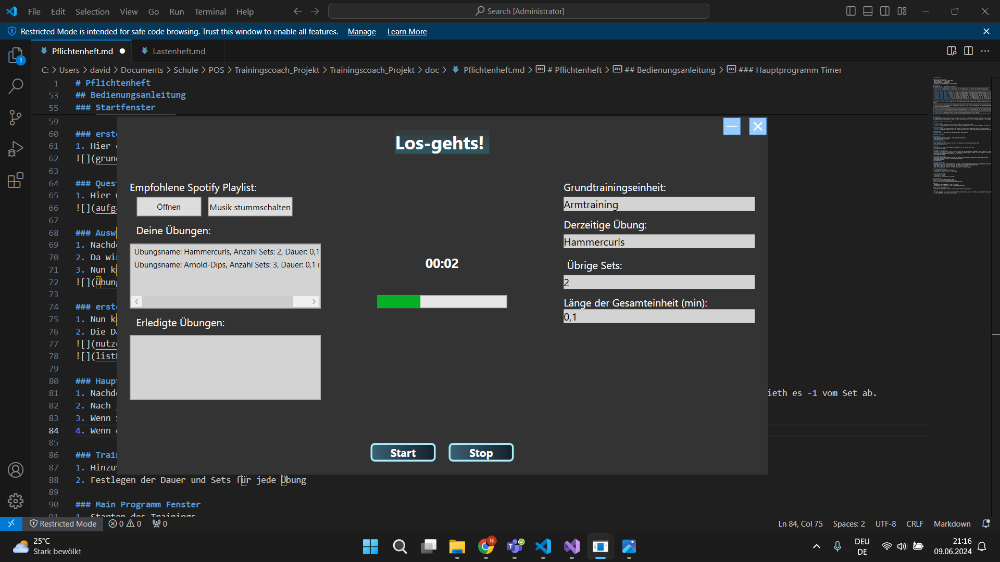
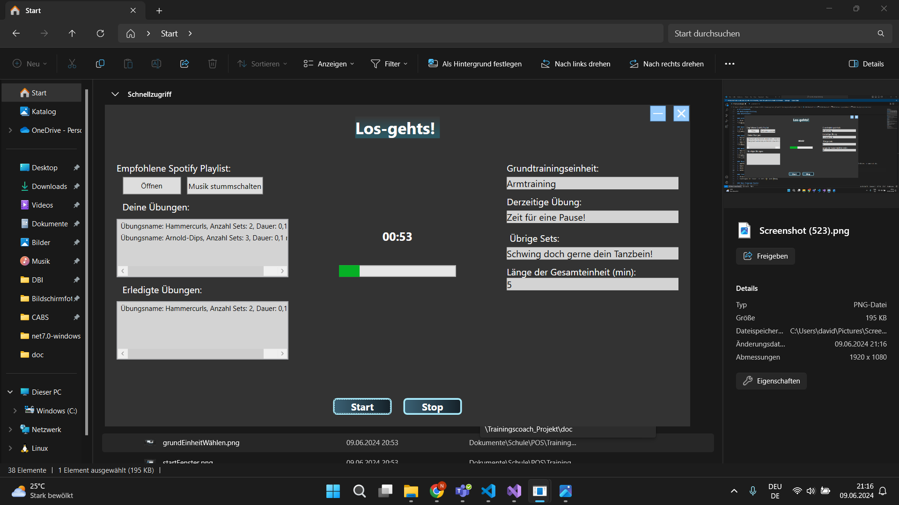
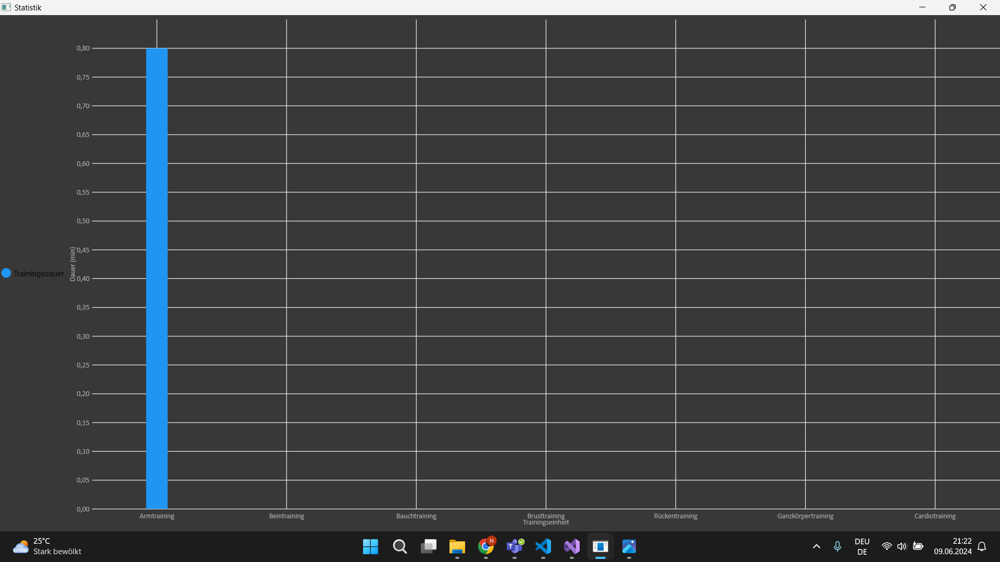

# Pflichtenheft
## Softwarevoraussetzungen
- Betriebssystem: Windows 10 oder höher
- .NET Framework 4.7.2 oder höher
- Visual Studio 2019 oder höher
- Soundkarte und Lautsprecher für Audiosignale

## Architektur
Das Projekt ist in 6 Hauptfenster unterteilt:
-------------------------------------------------------------------------------------------------------------|
1. **Menüfenster:** Startfenster zur Verwaltung der TrainingsSession und Auswahl der Grundtrainingseinheit
-------------------------------------------------------------------------------------------------------------|
------------------------------------------------------------------------------------------------------------------------------------------------------------|
2. **Auswahl Fenster (Arm):** Fenster zur Auswahl und Anpassung der Trainingseinheiten die per Auswahl der Grundtrainingseinheit im Menüfenster gewählt wird.
3. **Auswahl Fenster (Bauch):** Fenster zur Auswahl und Anpassung der Trainingseinheiten die per Auswahl der Grundtrainingseinheit im Menüfenster gewählt wird.
4. **Auswahl Fenster (Bein):** Fenster zur Auswahl und Anpassung der Trainingseinheiten die per Auswahl der Grundtrainingseinheit im Menüfenster gewählt wird.
5. **Auswahl Fenster (Brust):** Fenster zur Auswahl und Anpassung der Trainingseinheiten die per Auswahl der Grundtrainingseinheit im Menüfenster gewählt wird.
6. **Auswahl Fenster (Cardio):** Fenster zur Auswahl und Anpassung der Trainingseinheiten die per Auswahl der Grundtrainingseinheit im Menüfenster gewählt wird.
7. **Auswahl Fenster (Rücken):** Fenster zur Auswahl und Anpassung der Trainingseinheiten die per Auswahl der Grundtrainingseinheit im Menüfenster gewählt wird.
7. **Auswahl Fenster (Ganzkörper):** Fenster zur Auswahl und Anpassung der Trainingseinheiten die per Auswahl der Grundtrainingseinheit im Menüfenster gewählt wird.
------------------------------------------------------------------------------------------------------------------------------------------------------------|
------------------------------------------------------------------------------------------------------------------------------------------------------------|
8. **Angeben der Daten Fenster** Wenn man nun eine Übung auswählt z.B.: Liegestüzte im Armtrainingsfenster kann man in diesem Fenster die Anzagl und dauer pro Sets angeben.
------------------------------------------------------------------------------------------------------------------------------------------------------------|
------------------------------------------------------------------------------------------------------------------------------------------------------------|
9. **Hauptprogramm** hier werden alle ausgewählten Übungen per Liste richtig eingetragen. Das Hauptprogramm beginnt nun, der Timer tickt richtig, führt passend Pausen ein überprüft erledigte Aufgaben...
------------------------------------------------------------------------------------------------------------------------------------------------------------|
------------------------------------------------------------------------------------------------------------------------------------------------------------|
10. **Statistik Fenster** Das Statistik Fenster wertet deine Dauer pro Trainingssession aus und stellt sie grafisch dar.
------------------------------------------------------------------------------------------------------------------------------------------------------------|
------------------------------------------------------------------------------------------------------------------------------------------------------------|
11. **Quest Fenster** Das Quest Fenster gibt dir Übungsaufgaben die erfüllt werden können.
------------------------------------------------------------------------------------------------------------------------------------------------------------|

## Verknüpfung
Die Anwendung besteht aus mehreren Fenstern, die durch Klassen und Methoden miteinander verbunden sind. Jedes Fenster hat spezifische Funktionen zur Verwaltung der Trainingseinheiten, Speicherung und Laden der Daten sowie die Durchführung der Trainingssessions in einem Hauptprogramm mit Timer und einer Statistik.

## Mögliche Probleme und ihre Lösung

### Timer-Probleme
- **Problem:** Timer aktualisiert sich nicht richtig mit den nächsten Übungen.
- **Lösung:** Der 0te Index der ListBox wird nach jeder Übung gelöscht und die nächste Übung wird der neue 0te Index.

### Speicherprobleme
- **Problem:** Daten der ListBox werden nicht korrekt in einem Fenster gespeichert wenn man dieses schließt.
- **Lösung:** Implementierung einer Liste die sich mit dem Index der ListBox verknüpft und nun die Daten speichert.

## Testmethoden
- Manuelle Tests zur Überprüfung der Funktionalitäten jedes Fensters

## Bedienungsanleitung

### Startfenster
1. Hinzufügen, Auswählen, Speichern, Laden von Trainingssession
2. Man kann Aufgaben betrachten

### erstellen der Session: 
1. Hier erstellt man seine Session: Man wählt den Name und die passende Grundeinheit dazu

### Quests
1. Hier werden dem Nutzer die Aufgaben bereitgestellt die er dann erfüllen kann

### Auswählen einer Session:
1. Nachdem wir im Startfenster unsere erstellte Session mit der Grundeinheit ausgewählt haben kommen wir in dieses Fenster.
2. Da wir im Startfenster "Armtraining" als Grundeinheit ausgewählt haben, werden uns jetzt Übugen für Armtraining vorgeschlagen.
3. Nun können wir die Aufgaben auswählen, die wir wollen.

### erstellen einer Übung
1. Nun können wir beliebe Übungen erstellen und anpassen. Diese Eingaben werden dann für den Timer genutzt
2. Die Daten werden nun richtig in die ListBox hinzugefügt

### Hauptprogramm Timer
1. Nachdem wir auf Start drücken befüllt es die Daten richtig und die Trainings Session kann beginnen. Wenn die Zeit pro Sets fertig ist zieth es -1 vom Set ab.
2. Nach jedem Set ist eine kleine Pause und wenn Sets bei 0 ist startet die große Pause
3. Wenn Sets 0 kommt die nächste Übung dran und löscht die vorherige
4. Wenn die ListBox dann Leer ist --> keine Übung mehr --> Session beendet
5. Man kann auf empfohlene Spotify Playlist anklicken und Musik in der App muten

### Statistik nach Session
1. Nun wird die Statistik zu der jeweiligen Session ausgewertet und angezeigt

## Quellen
- verwendete Nuget Packages: Serilog.Core; Serilog, Live Charts

## Aktualisiertes GIT Repository
- Link zum Git Repository: [https://github.com/hofschmied/TrainingsBuddy]

# Fazit
- Wir sind im großen und ganzen sehr zufrieden mit unserem Projekt, da es im Grunde gut funktioniert und auch brauchbar ist. Wir haben vor allem viel neues dazugelernt
  und der Spaßfaktor war natürlich auch dabei.